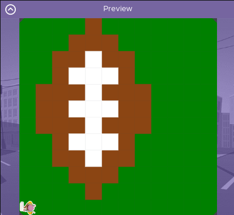

# AsphaltPainter
## Introduction

- I created two different painters to accomplish the goal of painting a football on a green background. One painted the background while the other painted the football using methods I created. 

## Output

## Reflection

**1. Describe your project.**

- My project is a 12 x 12 portrait of a football on a green background using two different painters to paint a background first then to paint the actual football. Ball first and then the laces are drawn.

**2. What are two things about your project that you are proud of?**

- I am proud of being able to make methods which function and do what I intended as well as the ability to debug my program in order to have it be the best it can be

**3. Describe something you would improve or do differently if you had an opportunity to change something abour your project.**

- Something I would improve in the future is the complexity of each of my methods. They are overcomplicated and could probably be completed in a much easier fashion. 
